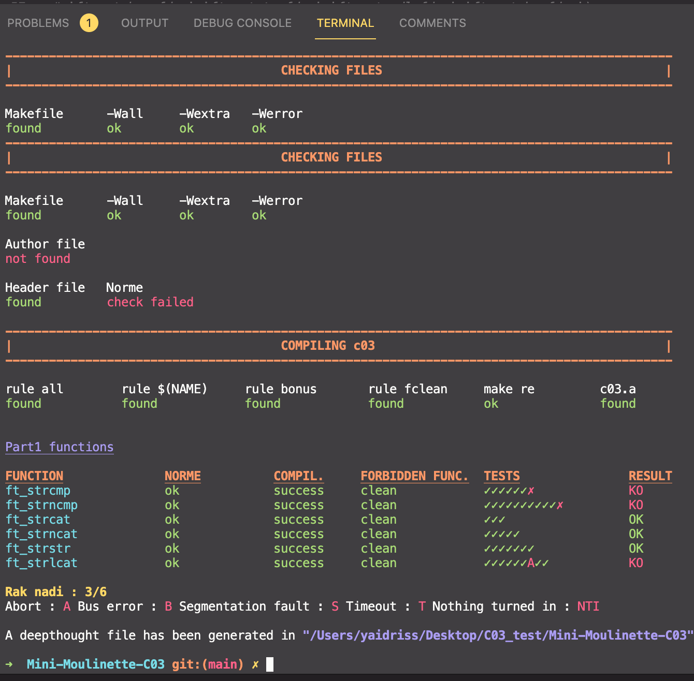

# PREAMBLE
Mini moulinette script bach tisti wach fichier kolchi nadi. <br/>
(ORIGINAL REP : https://github.com/yassineidrissi) <br/>
This update was made by @yaidriss <br/>

# Mini-Moulinette

kliki ala lien li bghiti bach tcloni tester li bghiti ala hsab days li andk.

| Project  | Link |
| ------------- | ------------- |
| How to use it (in darija)  | [on this page](https://github.com/y3ll0w42/Mini-Moulinette-c03/blob/master/supported_functions.md)  |
| C02  | [on this page](https://github.com/yassineidrissi/Mini_Moulinette_C02)  |
| C03  | [on this page](https://github.com/yassineidrissi/Mini-Moulinette-C03) |
| C04  | [on this page](https://github.com/yassineidrissi/Mini-Moulinette-C04)  |

script mli atkhdmo ghadi :

- ichof wach kaynin des fichies khrin ?
- wach ka3 li fichiers li kahsin kaynin
- Compili fichier b gcc -wall ...
- aychof wach kolchi hwa hdak f norminette
- aychof forbidden functions
- aTesti les functions o ykolk wach shah o fin kayn ghalat

mli tsali test, kyan wa7d fichier smyto deepthought ghadi itkriya wst Mini moulinete 
o ghatl9a fih les errors o les tests li dari o fin ghlti o fin li shih.

script ghadi i compary m3a funtion original dyal.

:warning:ka3 les tests machi officiel:warning:

## nbdaw 

### Installation

```bash
git clone https://github.com/y3ll0w42/Mini-Moulinette-c03
```

### Configuration

You can also choose the colors that will be used and the path where the

### Options available
| Option | Description |
| --- | --- |
| `-h`<br />`--help` | Display help and exit |
| `-d` | Allows to perform the tests even if the files are in directories |
| `-c` | Disable color |
| `-s` | Disable searching Makefile and author files |
| `-m` | When compiling library, test all the Makefile's rules (instead of doing only make re and checking if other rules exist). |


Add successively all options you want, in the order you want.
For example :
```bash
bash grademe.sh ft_strcmpy -f ft_ -n
```

### Supported functions
ha chno kaysiporti mini moulennete [on this page](https://github.com/yassineidrissi/Mini-Moulinette-c03/blob/master/supported_functions.md).

### Contributors
- yaidriss : https://github.com/yassineidrissi
# C_tester_1337
# Mini-Moulinette
